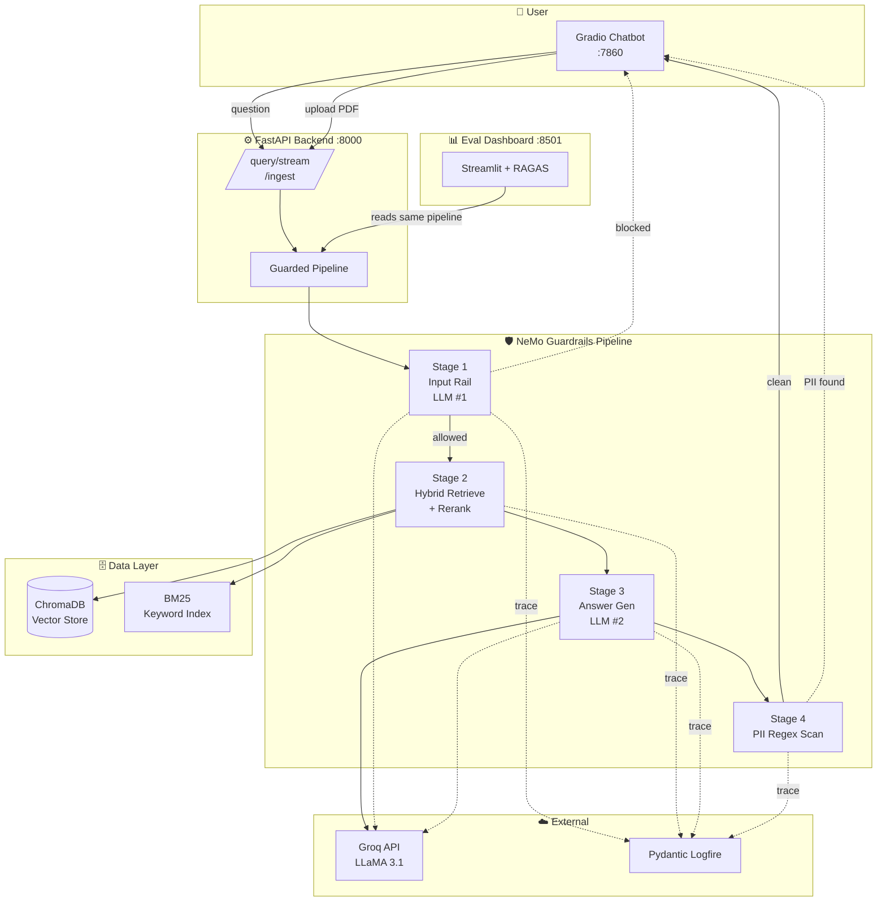
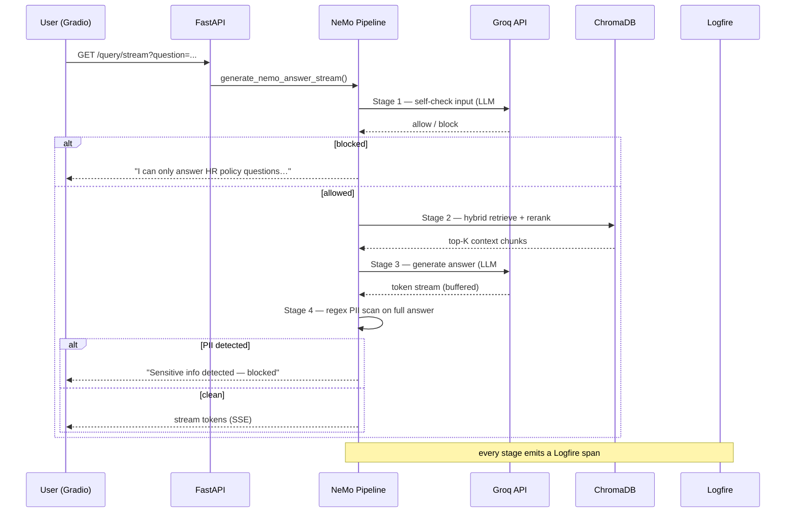
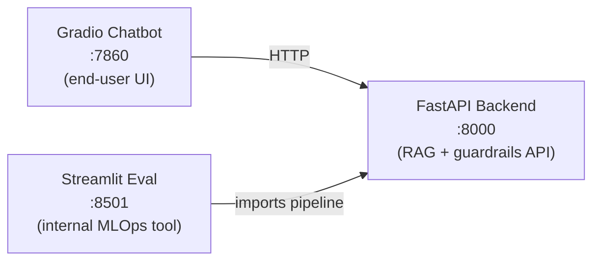

# Enterprise RAG Chatbot

An **enterprise-grade Retrieval-Augmented Generation (RAG) chatbot** that answers questions
from your own PDF documents — with **NeMo Guardrails** for safety, **RAGAS** for automated
evaluation, **Pydantic Logfire** for observability, and **token-by-token streaming** for a
responsive UX.

Upload an HR/policy PDF, ask a question in natural language, and get a grounded answer that is
guarded on the way in (off-topic / jailbreak filtering) and on the way out (PII leak
prevention) — with every stage traced.

---

## Table of Contents

1. [Highlights](#highlights)
2. [System Architecture](#system-architecture)
3. [The Guardrail Pipeline (4 Stages)](#the-guardrail-pipeline-4-stages)
4. [Service Layout (3 Ports)](#service-layout-3-ports)
5. [Tech Stack](#tech-stack)
6. [Project Structure](#project-structure)
7. [Getting Started](#getting-started)
8. [Environment Variables](#environment-variables)
9. [Running the Services](#running-the-services)
10. [Evaluation (RAGAS)](#evaluation-ragas)
11. [Observability (Logfire)](#observability-logfire)
12. [API Reference](#api-reference)
13. [Key Design Decisions](#key-design-decisions)
14. [Future Improvements](#future-improvements)
15. [Author](#author)

---

## Highlights

| Capability | What it does |
|---|---|
| 🔍 **Hybrid retrieval** | Combines semantic (vector) + keyword (BM25) search, then reranks with a cross-encoder |
| 🛡️ **NeMo Guardrails** | 4-stage pipeline: input filter → retrieve → answer → PII scan |
| 📊 **RAGAS evaluation** | 7 metrics (Faithfulness, Answer Correctness, Context Precision/Recall, Relevancy, Hit Rate, MRR) |
| 🔭 **Logfire observability** | Every request and every stage is traced to a cloud dashboard |
| ⚡ **Streaming responses** | Tokens render in the UI as they arrive (buffered for the PII check) |
| 🔑 **Rate-limit isolation** | A separate judge API key so eval runs never exhaust the chatbot's quota |
| 🐳 **Dockerized** | `docker compose up` starts the backend + chatbot together |

---

## System Architecture



**End-to-end flow of one question:**



---

## The Guardrail Pipeline (4 Stages)

Every allowed message costs **two LLM calls** — one to guard, one to answer. Blocked messages
short-circuit after the first call.

| Stage | Name | LLM? | Responsibility |
|:---:|---|:---:|---|
| **1** | `self check input` | ✅ LLM #1 | Block **off-topic** chatter and **jailbreak** attempts only |
| **2** | `retrieve_context` | ❌ | Hybrid vector + BM25 search → cross-encoder rerank → top-K chunks |
| **3** | `generate_answer` | ✅ LLM #2 | Groq produces the answer grounded in the retrieved context |
| **4** | `scan_for_pii` | ❌ | Regex scan of the answer for SSN, credit-card, email, salary figures |

**Critical design rule — stage responsibilities never overlap:**

- **Stage 1 is an *intent* gate.** It asks *"is this a legitimate document question?"* It does
  **not** block questions just because they mention sensitive words — "What's the contact email
  for HR?" is allowed through.
- **Stage 4 is a *content* gate.** It scans the *generated answer* for actual PII patterns.

Mixing these up was an early bug: putting PII in Stage 1's block list caused it to reject
legitimate document queries. Keeping intent (Stage 1) separate from content (Stage 4) is what
makes the guardrail correct.

**Fallback messages:**

| Trigger | Message shown to user |
|---|---|
| Stage 1 block | *"I can only answer questions about the uploaded HR policy documents…"* |
| Stage 4 block | *"I've detected potentially sensitive personal information in my response and have blocked it for safety…"* |

The guardrails are **fail-open**: if NeMo errors, the request falls back to raw RAG rather than
blocking all traffic. Set `GUARDRAILS_ENABLED=false` in `.env` to bypass the gate entirely.

---

## Service Layout (3 Ports)

The system is intentionally split into three independent services so a crash or redeploy of one
never affects the others.



| Port | Service | Audience | Start command |
|:---:|---|---|---|
| **8000** | FastAPI backend | (internal) | `uvicorn app.main:app --port 8000` |
| **7860** | Gradio chatbot | End users | `python app/ui/ui_gradio.py` |
| **8501** | Streamlit eval dashboard | ML engineers | `streamlit run app/ui/eval_ui.py` |

---

## Tech Stack

| Component | Purpose |
|---|---|
| **FastAPI + Uvicorn** | Backend API (`/ingest`, `/query`, `/query/stream`) |
| **Gradio** | End-user chatbot UI with streaming |
| **Streamlit** | RAGAS evaluation dashboard |
| **Groq API** | High-speed LLM inference (LLaMA 3.1 8B) |
| **ChromaDB** | Vector store for semantic retrieval |
| **rank-bm25** | Keyword retrieval (hybrid search) |
| **Sentence-Transformers** | `all-MiniLM-L6-v2` embeddings + cross-encoder reranker |
| **PyMuPDF (`fitz`)** | PDF text extraction |
| **NeMo Guardrails** | Colang-based input/output rails |
| **RAGAS** | Automated RAG evaluation (LLM-as-judge) |
| **Pydantic Logfire** | OpenTelemetry-based tracing / observability |
| **Docker Compose** | Multi-service orchestration |

---

## Project Structure

```
enterprise-rag-chatbot/
├── app/
│   ├── main.py                     # FastAPI entrypoint + Logfire + NeMo warmup (lifespan)
│   ├── api/
│   │   └── routes.py               # /health, /ingest, /query, /query/stream (SSE)
│   ├── core/
│   │   └── config.py               # env vars: keys, models, chunking, guardrail switch
│   ├── llm/
│   │   └── groq_client.py          # query_groq() + query_groq_stream()
│   ├── rag/
│   │   ├── rag_pipeline.py         # PDF → text → chunks
│   │   ├── hybrid_retriever.py     # vector + BM25 merge
│   │   ├── keyword_retriever.py    # BM25 keyword search
│   │   ├── reranker.py             # cross-encoder reranking
│   │   ├── retriever.py            # raw (un-guarded) RAG answer
│   │   └── guarded_pipeline.py     # routes to NeMo, or raw RAG if disabled
│   ├── guardrails/
│   │   ├── nemo_pipeline.py        # 4-stage orchestrator + streaming + Logfire spans
│   │   └── nemo/
│   │       ├── config.yml          # NeMo rails config (input/output flows)
│   │       ├── rails.co            # Colang flows (the 4 stages)
│   │       └── prompts.yml         # self_check_input prompt (Stage 1)
│   ├── vectorstore/
│   │   └── chroma_store.py         # index + query ChromaDB
│   ├── preprocessing/
│   │   └── text_preprocessor.py    # semantic chunking
│   ├── eval/
│   │   ├── eval_dataset.json       # 10 golden Q&A with target metrics
│   │   ├── ingest_fixed_doc.py     # index the fixed eval PDF
│   │   └── run_ragas_eval.py       # RAGAS + Hit Rate/MRR runner
│   └── ui/
│       ├── ui_gradio.py            # chatbot UI (:7860, streaming)
│       └── eval_ui.py              # eval dashboard (:8501, 3 tabs)
├── docker/
│   └── Dockerfile
├── docker-compose.yml              # backend + ui services
├── requirements.txt
├── .env                            # secrets (gitignored)
└── README.md
```

---

## Getting Started

### 1. Prerequisites

- Python 3.10+
- A [Groq API key](https://console.groq.com/) (free tier works)
- *(Optional)* A [Logfire token](https://logfire.pydantic.dev/) for cloud tracing
- *(Optional)* Docker Desktop

### 2. Clone and create a virtual environment

```bash
git clone https://github.com/yourusername/enterprise-rag-chatbot.git
cd enterprise-rag-chatbot

python -m venv venv
# Windows
.\venv\Scripts\Activate.ps1
# macOS/Linux
source venv/bin/activate
```

### 3. Install dependencies

```bash
pip install -r requirements.txt
```

> **Windows note:** always run the UIs through the venv Python
> (`.\venv\Scripts\python.exe -m streamlit run …`), otherwise the global Python is used and
> imports like `langchain_huggingface` will fail.

### 4. Configure environment

Create a `.env` file (see [Environment Variables](#environment-variables)).

---

## Environment Variables

| Variable | Required | Default | Description |
|---|:---:|---|---|
| `GROQ_API_KEY` | ✅ | — | Main key for the chatbot's answer LLM |
| `JUDGE_GROQ` | ➖ | falls back to `GROQ_API_KEY` | Separate key for the RAGAS judge (rate-limit isolation) |
| `GROQ_MODEL` | ➖ | `llama-3.1-8b-instant` | Answer + judge model |
| `GUARD_MODEL` | ➖ | `llama-3.1-8b-instant` | Stage 1 input classifier model |
| `GUARDRAILS_ENABLED` | ➖ | `true` | Master on/off switch for the guardrail pipeline |
| `LOGFIRE_TOKEN` | ➖ | — | Enables cloud tracing; console-only if unset |
| `CHROMA_PATH` | ➖ | `./chroma_store` | Vector store location |
| `COLLECTION_NAME` | ➖ | `enterprise_docs` | ChromaDB collection |
| `TOP_K` | ➖ | `3` | Chunks passed to the LLM after reranking |
| `CHUNK_SIZE` / `CHUNK_OVERLAP` | ➖ | `500` / `50` | Chunking parameters |
| `EMBEDDING_MODEL` | ➖ | `all-MiniLM-L6-v2` | Embedding + judge embedding model |

Example `.env`:

```dotenv
GROQ_API_KEY=gsk_your_chatbot_key
JUDGE_GROQ=gsk_your_separate_judge_key
GROQ_MODEL=llama-3.1-8b-instant
GUARD_MODEL=llama-3.1-8b-instant
GUARDRAILS_ENABLED=true
LOGFIRE_TOKEN=pylf_v2_...
CHROMA_PATH=./chroma_store
COLLECTION_NAME=enterprise_docs
TOP_K=3
CHUNK_SIZE=500
CHUNK_OVERLAP=50
EMBEDDING_MODEL=all-MiniLM-L6-v2
```

---

## Running the Services

### Option A — Docker Compose (backend + chatbot)

```bash
docker compose up --build
```

- Backend → http://localhost:8000
- Chatbot → http://localhost:7860

### Option B — Manual (all three services)

Open three terminals (venv activated in each):

```bash
# Terminal 1 — backend
uvicorn app.main:app --host 0.0.0.0 --port 8000

# Terminal 2 — chatbot UI
python app/ui/ui_gradio.py

# Terminal 3 — eval dashboard
python -m streamlit run app/ui/eval_ui.py
```

Then open http://localhost:7860, upload a PDF, and start asking questions.

---

## Evaluation (RAGAS)

The Streamlit dashboard (`:8501`) has **three tabs**:

1. **Goldens** — the 10 curated Q&A pairs, each with a `target_metric` and note.
2. **Run Evaluation** — a ▶ Run button per question; shows the model answer next to the
   reference answer.
3. **Results** — aggregate means + per-question score tiles (green ≥ 0.8, amber ≥ 0.5, red < 0.5).

**Metrics computed** (`app/eval/run_ragas_eval.py`):

| Metric | Question it answers |
|---|---|
| **Faithfulness** | Is the answer grounded in the retrieved context? |
| **Response Relevancy** | Does the answer actually address the question? |
| **Context Precision** | Were the retrieved chunks relevant? |
| **Context Recall** | Did retrieval find everything the answer needed? |
| **Answer Correctness** | Is the answer factually correct vs. ground truth? |
| **Hit Rate** | Did retrieval surface at least one relevant chunk? |
| **MRR** | How high was the first relevant chunk ranked? |

**LLM-as-Judge:** RAGAS defaults to OpenAI. This project overrides that to use **Groq** as the
judge LLM and **local MiniLM** embeddings — so the only required key is a Groq key. The judge
uses `JUDGE_GROQ` (a *separate* key) so evaluation bursts never exhaust the chatbot's rate limit.

CLI run:

```bash
python -m app.eval.ingest_fixed_doc   # once, to index the fixed eval PDF
python -m app.eval.run_ragas_eval     # run the full evaluation
```

---

## Observability (Logfire)

Every request is traced with **Pydantic Logfire** (OpenTelemetry under the hood):

```
guardrail_pipeline
├── stage1_input_rail
├── stage2_retrieval
├── stage3_answer_generation
└── stage4_pii_scan
```

- `logfire.instrument_fastapi(app)` auto-traces every HTTP request.
- Each pipeline stage emits structured logs (latency, chunk counts, PII matches).
- Set `LOGFIRE_TOKEN` to stream to the cloud dashboard; leave it unset for console-only output
  (`send_to_logfire="if-token-present"`).

> **Note:** the streaming path uses flat `logfire.info()` calls rather than `with logfire.span()`
> context managers, because yielding inside a span across FastAPI's `StreamingResponse` thread
> boundary triggers an OpenTelemetry *"token created in a different Context"* error.

---

## API Reference

| Method | Endpoint | Description |
|---|---|---|
| `GET` | `/health` | Liveness check |
| `POST` | `/ingest` | Upload one or more PDFs; extracts, chunks, and indexes them |
| `POST` | `/query` | Guarded RAG answer (blocking, returns JSON) |
| `GET` | `/query/stream?question=…` | Guarded RAG answer streamed as Server-Sent Events |

**`POST /query`** body:

```json
{ "question": "How much annual leave am I entitled to?", "top_k": 3 }
```

**`GET /query/stream`** response (SSE):

```
data: Annual
data:  leave
data:  is …
data: [DONE]
```

---

## Key Design Decisions

- **Two LLM calls per message** — one dedicated guard call, one answer call. This makes the
  safety decision independent of the answer generation.
- **Stage 1 vs Stage 4 separation** — intent filtering (input) is deliberately kept separate
  from content filtering (output) so legitimate document queries aren't wrongly blocked.
- **Buffer-then-scan streaming** — Stage 3 tokens are buffered until Stage 4's PII scan passes,
  so no partial sensitive content is ever shown, while the user still sees a typing animation.
- **Two API keys** — `JUDGE_GROQ` isolates evaluation traffic from the chatbot's rate-limit
  budget.
- **Three independent services** — separate ports/processes so eval, chatbot, and backend can be
  developed, restarted, and scaled independently.
- **Fail-open guardrails** — an error in NeMo degrades to raw RAG rather than blocking all users.

---

## Future Improvements

- **Conversation memory** — multi-turn context so follow-up questions resolve pronouns.
- **Source citations** — surface which chunk/page each answer came from.
- **CI eval gate** — GitHub Action that fails the build if Faithfulness drops below a threshold.
- **Response caching** — Redis layer to skip the pipeline for repeat questions.
- **User feedback (👍/👎)** — collect bad answers as future golden questions.
- **Auth + rate limiting** — protect the backend API in production.

---

## Author

**Namit Jain**
Enterprise RAG Chatbot — internship project.
